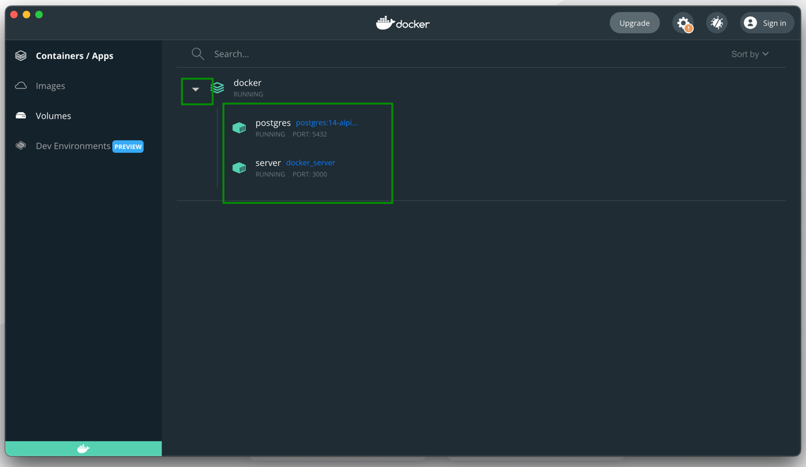
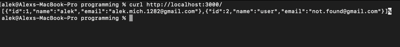

## Docker Guide
Run your application in virtual containers via docker

### install docker
- select docker desktop depends on your OS [here](https://www.docker.com/get-started/)


- run docker desktop


### build and run docker containers

in the root directory of repository:
````shell
docker-compose build
docker-compose up -d
````

you should see running containers in the docker


to check the server works, run in command line:
```shell
curl http://localhost:3000/
```

you should get users list as response:
